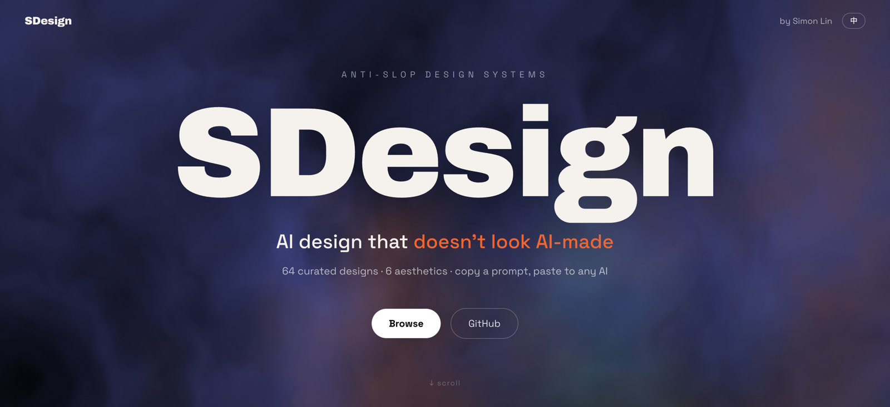
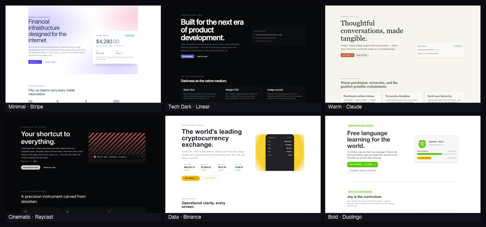

<p align="center">
  
</p>

<h1 align="center">SDesign · 去 AI 味设计系统库</h1>

<p align="center">
  让你的 AI 做出 <b>不像 AI 做的</b> 网页 / 落地页。<br>
  挑一个<b>美学</b>,复制它的提示词,粘给你的 AI —— 出来的东西有设计师的味道,不是默认的 AI 烂味。
</p>

<p align="center">
  🎨 6 大美学家族 · ✨ 64 个<b>真不一样</b>的设计 · ⚡ 复制即用 · 🧹 内置去 AI 味硬规则 · 🆓 免费 · 零安装 · 不登录
</p>

<p align="center">
  
  
  
  
  
</p>

<p align="center"><b>中文</b> · <a href="README.en.md">English</a></p>

<p align="center">
  <a href="https://sdesign.one/"><b>🔗 在线预览 Live Demo</b></a> —— 点开即看 64 个设计效果,复制即用,无需安装
</p>

---

<p align="center">
  <a href="https://sdesign.one/">
    
  </a>
</p>

## 这是什么

AI 默认吐的设计都长一个样:居中大标题、三张一模一样的卡、紫蓝渐变、emoji、"赋能你的工作流"。**SDesign 把这一切治好。**

- 🎨 **6 个美学家族 · 64 个独特设计** —— 每个带**精确设计 token**(配色 / 字体 / 圆角)+ **范本页** + **本美学特别说明**。每个都是真不一样的设计,**没有换色凑数的重复模板**。
- 🧹 **去 AI 味硬规则** —— 一套机械可执行的纪律,逼 AI 守规矩(实测 Claude 级和小米 MiMo 级都遵守)。
- ⚡ **即插即用** —— 复制一段提示词,粘给任意 AI(Claude / ChatGPT / Codex…),做出的页面就在那个美学调性上、**不飘**。
- 🖍️ **配图(手绘去 AI 味)** —— 另一条线:给中文正文配一张**手绘风插画**([`illustration/`](illustration/)),不是整页排版。满屏精致 AI 配图本身就是 AI 味重灾区,手绘草图反其道而行。

---

## 怎么用(两种,任选)

### A · 复制提示词(零门槛,任何 AI 都行)
1. 在 [`aesthetics/`](aesthetics/) 挑一个美学家族 → 进去挑一个设计系统(如 `tech-dark/linear-app/`)。
2. 打开它的 `prompt.md`,复制代码块里那一整段。
3. 粘给你的 AI,后面接一句"给我做个 XXX 页面"。
4. 出来的东西就在这个美学调性上,而且没有 AI 味。

### B · 装进 Claude Code(让 agent 自动选)
把本仓库放进项目,Claude Code 读 [`SKILL.md`](SKILL.md) 就会按你的需求自动挑美学、套规则。

> 💡 本库以**网页 / 落地页**为主(token 是 CSS 单位)。做 PPT / 海报时,借它的**配色 + 字体气质 + 去 AI 味纪律**即可,具体尺寸自行换算。

---

## 6 个美学家族 · 共 64 个独特设计

| 家族 | 数 | 一句话 | 代表设计 |
|---|---|---|---|
| 极简留白 | 32 | 中性色 + 单强调色 + 大留白,为阅读而生 | Airbnb · Stripe · Notion |
| 科技暗黑 | 15 | 深底 + 高对比 + 霓虹强调,开发者气质(含终端等宽) | Linear · Supabase · Warp |
| 暖色人文 | 7 | 奶油暖色 + 衬线 + 大留白,有人味 | Claude · Cursor · Arc |
| 电影暗调 | 3 | 电影渐变 + 超大字 + 深色,震撼高级 | Raycast · SpaceX · Runway |
| 数据密集 | 3 | 图表为主 + 暗仪表盘,信息高密度 | Binance · ClickHouse · GitHub |
| 大胆彩色 | 4 | 高饱和 / 插画 / 硬边粗野 / 超大数字,强烈抓眼 | Duolingo · Canva · Hugging Face |

> 完整设计见各 `aesthetics/<家族>/` 目录,或 [`index.json`](index.json)。

---

## 为什么是 SDesign

| | 全网"设计资源"合集 | open-design 原库 | **SDesign** |
|---|---|---|---|
| **数量** | 几百个条目,真伪难辨 | 标 150+,**约一半是同一模板换色凑数** | **64 个,每个真不一样**(换皮的全删了) |
| **提示词** | 多半要自己拼 | 偏开发框架 / 桌面 app | **一键自包含**,复制即用 |
| **去 AI 味** | 多为通用建议 | 无专门约束 | **硬规则按美学分条件**,逼弱模型也守 |
| **形态** | 列表 / 文档 | 桌面 app + MCP | **一个 skill**,塞给 Claude 就行 |

**核心差异:不堆数量,堆"真不一样" + "粘了就出片"。** 我们逐张看图筛掉了 open-design 里换色凑数的模板,只留各不相同的设计。

---

## 仓库结构

```
SDesign-V2/
├── SKILL.md                 Claude Code 入口(6 家族路由 + 铁律)
├── rules/anti-slop.md       去 AI 味硬规则(唯一真相源,内联进每个提示词)
├── aesthetics/<家族>/<设计系统>/
│   ├── prompt.md            ★ 一键提示词(复制这个)
│   ├── tokens.json          精确设计 token
│   ├── reference.html       范本页(来自 open-design)
│   └── reference.png        范本截图
├── illustration/            配图子能力(手绘去 AI 味文章插画,与 aesthetics 并列)
├── scripts/                 fetch / build / audit(可重跑)
├── website/                 在线预览站源码(Vite + React,自动发布到 GitHub Pages)
├── assets/                  README 配图
└── index.json               机器可读索引
```

每个设计系统的 `prompt.md` 是**自包含**的——把 token、本美学特别说明、去 AI 味规则焊成一段,复制即用,无需安装任何东西。

---

## 重建 / 扩展

改 [`scripts/skins.json`](scripts/skins.json)(加设计系统、换大牌、改分类 / 特别说明)后:
```bash
node scripts/fetch-from-od.mjs   # 从 open-design 抓 token + 范本
node scripts/build-prompts.mjs   # 生成 prompt.md + index.json
```
自检你的产出有没有 AI 味:`node scripts/audit.mjs 你的产出.html`

---

## 致谢 & 协议

- 美学素材策展自 [nexu-io/open-design](https://github.com/nexu-io/open-design)(Apache-2.0),详见 [`NOTICE`](NOTICE)。
- 本仓库代码与文档:MIT(见 [`LICENSE`](LICENSE))。
- 纯分享,免费。觉得有用,点个 ⭐ 就是支持。

> ⚠️ **品牌中立声明**:本库与所列各品牌(Linear / Apple / Claude / Stripe 等)**无任何关联、非官方资产**;品牌名仅用于**描述其公开视觉风格**(灵感参考)。各商标归其所有者。
